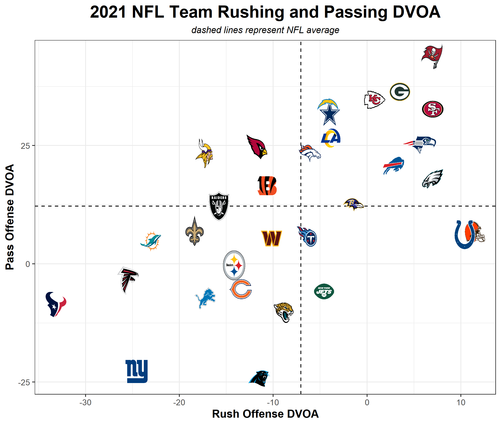

# My Data Analytics Portfolio

---

### Sports Analytics Projects

#### [Why the New York Mets' offense is a big problem heading into the playoffs](/files/Why the Mets' offense is a big problem heading into the playoffs.docx)

As the New York Mets neared the 2022 playoff push, I explored their offensive struggles and how they might cause the team issues heading into October. 

You can find the code that I used to generate the data [here](/files/mets_2022_runs_scored.R).

---
#### [How EPA and DVOA correlate with winning in the NFL](/files/pass_rush_rankings_epa.R)

I explored Expected Points Added and Defense-adjusted Value Over Average as useful analytics in predicting wins and future production.

---
#### [How NFL teams have drafted during this millennium](/files/nfl_draft_20_21_av.R)

---

### General Analytics Projects

- [Bikeshop Data Exploration and Recommendations](http://example.com/)
- [Project 2 Title](http://example.com/)
- [Project 3 Title](http://example.com/)
- [Project 4 Title](http://example.com/)
- [Project 5 Title](http://example.com/)

---

