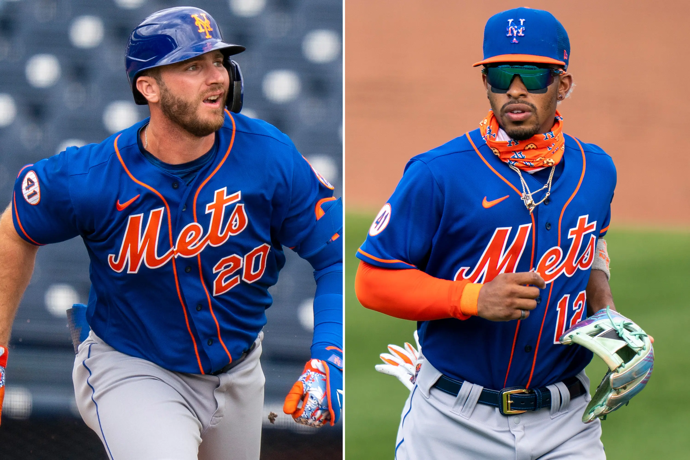

# My Data Analytics Portfolio

---

### General Analytics Projects

#### [HR Employee Attrition Reduction](/files/recommendation_algorithm.R)

I wrote and built custom functions and models in R to assess the main drivers behind employee attrition and implemented a personalized plan to promote retention, which saved a company $15 million.

#### [SQL Healthcare Analysis](https://www.linkedin.com/pulse/sql-healthcare-analysis-rivka-boord-kvxwe%3FtrackingId=QQIF58k%252FcaRDaG4jL69LvQ%253D%253D/?trackingId=QQIF58k%2FcaRDaG4jL69LvQ%3D%3D)

I utilized SQL to analyze healthcare data and answer hospital management's questions.

#### [Bikeshop Data Exploration and Recommendations](/files/03_sales_report.pdf)

I took bikeshop data regarding sales of different types of bikes and generated a report. [Here](/files/03_sales_report.Rmd) is the code used to generate the report.

#### [SQL Murder Mystery](https://www.linkedin.com/pulse/sql-murder-mystery-rivka-boord-cnrpe%3FtrackingId=DEeRLntbVN65NCoeyb6ZuA%253D%253D/?trackingId=DEeRLntbVN65NCoeyb6ZuA%3D%3D)

This murder mystery starts with just three pieces of information: the type of crime—murder—and the date and location. Using optimized SQL queries, I found out who the murderer was—and who hired him.
---

### Sports Analytics Projects

#### [What is a first-round pick worth in baseball?](https://www.linkedin.com/pulse/what-first-round-pick-worth-baseball-rivka-boord/?trackingId=8t9eQ3RsTnmPsBwoZj282g%3D%3D)

In the NFL, draft picks are considered valuable commodities, especially first-round picks. I examined whether that is the case using WAR and All-Star Game data and drew some conclusions about prospects, as well. [Here](/files/Importing draft picks.R/) is the code I wrote to generate my insights.

---

#### [The numbers prove that Zach Wilson's chances of turning around are minuscule](https://jetsxfactor.com/2022/10/31/ny-jets-concern-qb-position/)

Following the New York Jets' first loss to the New England Patriots in 2022, 22-17, I went back into NFL history from the last 20 years to explore what the data says about Zach Wilson's long-term prospects. The answer was grim, and it bore out in the fact that he was benched before completing his second season as the former No. 2 overall pick.

#### [Does Zach Wilson's height affect him as a quarterback?](https://jetsxfactor.com/2022/11/03/zach-wilson-height-struggles/)

There was a perception among some New York Jets fans that Zach Wilson's height made it more difficult for him to succeed as an NFL quarterback. I decided to look back at both the numbers and the history of previous quarterbacks of a similar height to explore whether the claim had any merit.

#### [How Mike LaFleur can improve his play-calling in 2022](https://jetsxfactor.com/2022/07/18/how-can-ny-jets-mike-lafleur-improve-play-calling-2022/)

Heading into the 2022 season, the New York Jets had a lot to improve on offense. I took a look at some of their offensive play-calling trends and discussed what needed to change for the Jets to be successful.

#### [Why the New York Mets' offense is a big problem heading into the playoffs](/files/Why the Mets' offense is a big problem heading into the playoffs.docx)

As the New York Mets neared the 2022 playoff push, I explored their offensive struggles and how they might cause the team issues heading into October. 

You can find the code that I used to generate the data [here](/files/mets_2022_runs_scored.R).

#### [The New York Jets' play-calling was predictable in 2022 Week 14 loss to Bills](https://jetsxfactor.com/2022/12/13/lafleur-play-calling-predictable/)

Using a metric called XPASS, I examined the Jets' play-calling tendencies in their 20-12 loss to the Bills from 2022 and explained how the predictability directly contributed to their defeat.

---
